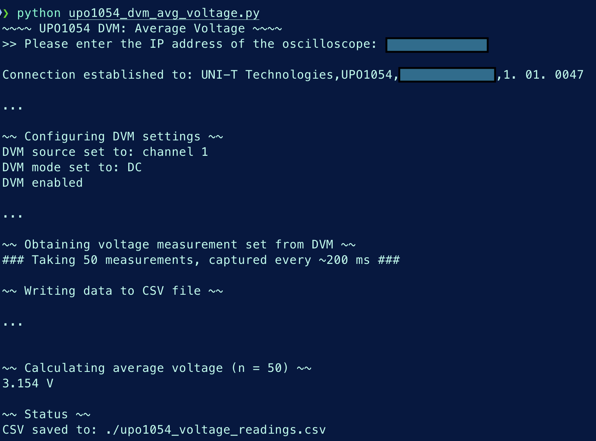
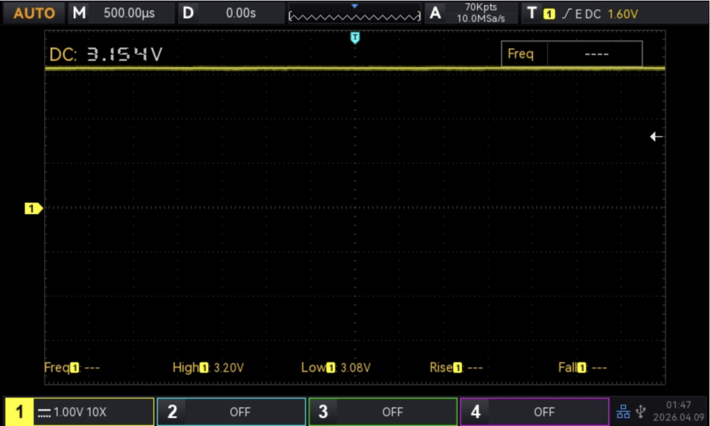

# Uni-T UPO1054 PyVISA Tools
A repository for scripts to automate control of the Uni-T UPO1054 oscilloscope via PyVISA and SCPI.

<figure>
  
  <figcaption><em>Uni-T UPO1054 connected to the Nordic Thingy:53, automating use of DVM via SCPI.</em></figcaption>
</figure>

##

<figure>
  
  <figcaption><em>Script Output: DVM Average Voltage.</em></figcaption>
</figure>

##

<figure>
  
  <figcaption><em>UPO1054 Screen Capture: Captured via LAN Interface.</em></figcaption>
</figure>

